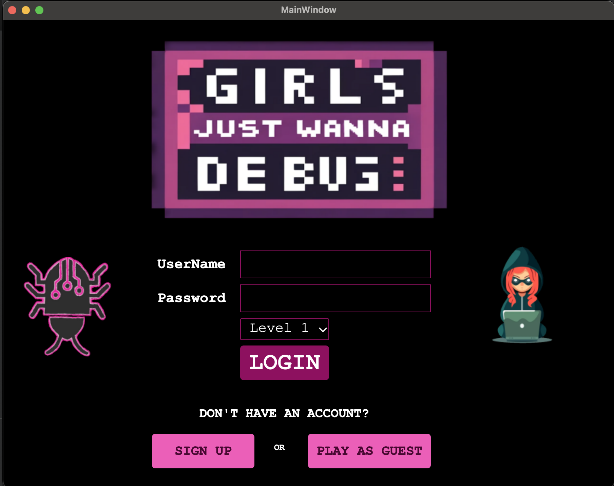
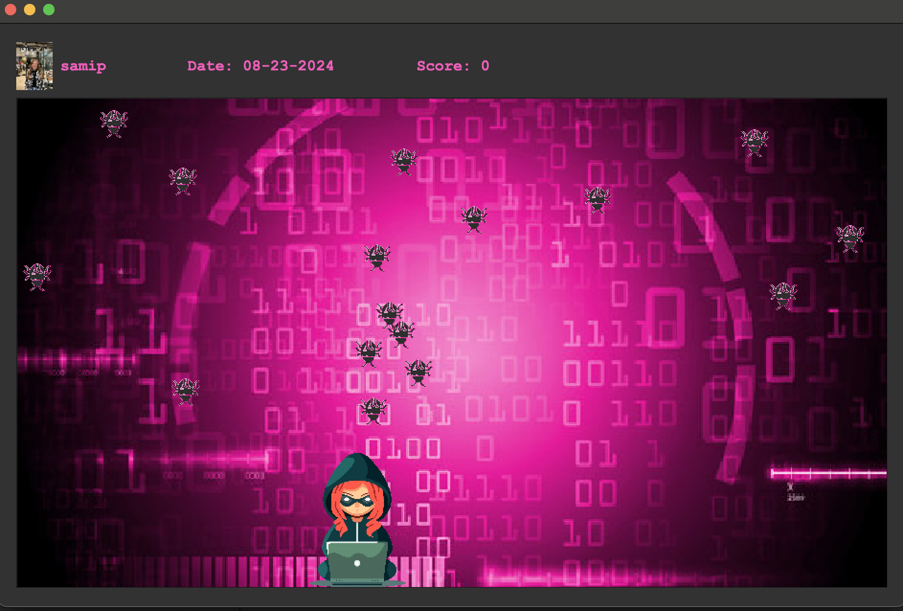
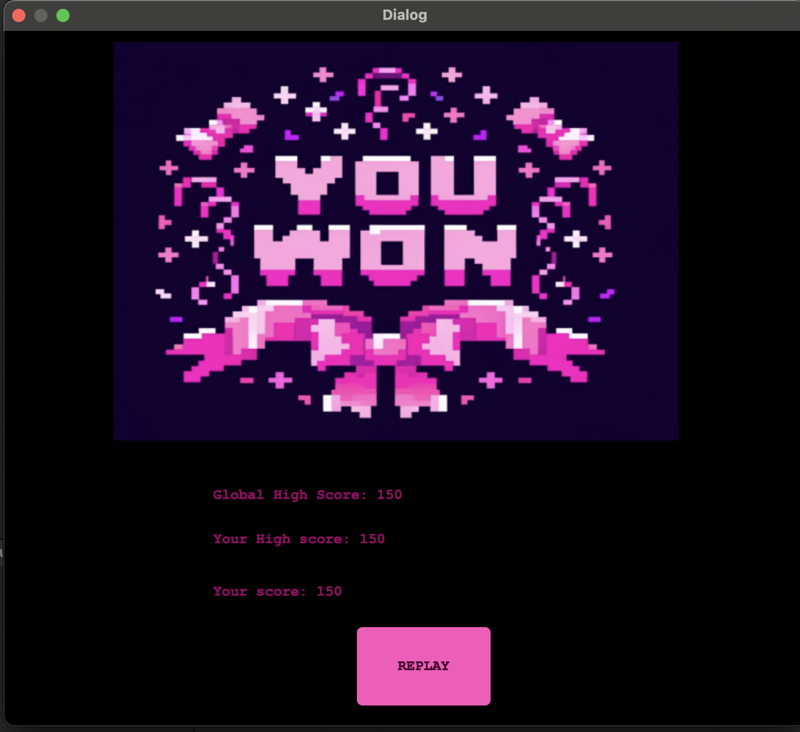
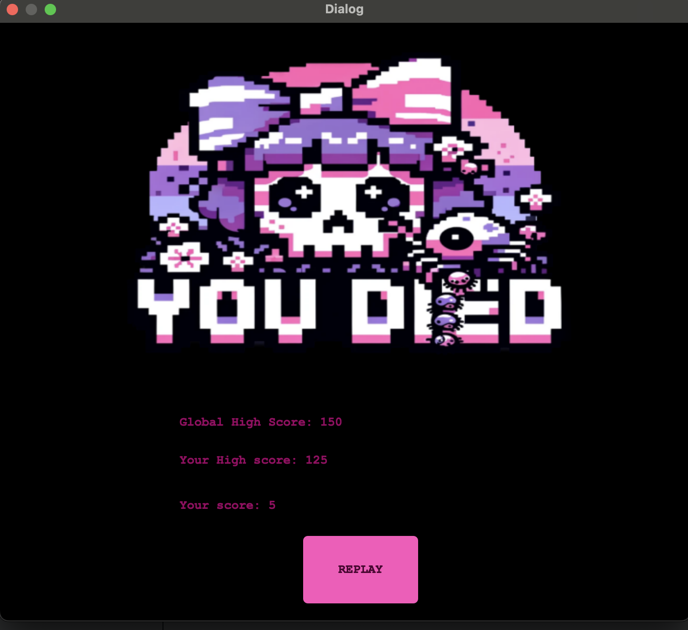

# Girls Just Wanna Debug

## Languages/Technologies Used:
- C++
- Qt Creator
- JSON
- AGILE Sprint
- GitHub for project management and collaboration

## Key Features
- **User Management**: Stores users utilizing JSON principles for data handling, allowing persistent user profiles.
- **Screen Switching**: Seamless transitions between login, gameplay, and end screens.
- **Difficulty Levels**: Players can select from different levels of difficulty, adjusting the speed of falling bugs.
- **Dynamic Gameplay**: Bugs fall from the top of the screen and increase in speed as the game progresses. The player must catch them using left and right arrow keys.
- **High Score Tracking**: Tracks and displays high scores. If a player beats their high score, a "You Won" screen is displayed.
- **Game Over Screen**: Displays a death screen when the player fails to catch the bugs.

## Screenshots

## Project Summary:
"Girls Just Wanna Debug" is a collaborative game project developed over two, one-week sprints using AGILE methodologies. Working with two other classmates, we leveraged GitHub for project management, tracking progress, and coordinating updates. The game offers a user-friendly interface where players can log in, sign up, or play as a guest. Players can choose from different difficulty levels, which influence the speed at which bugs fall from the top of the screen. The objective is to catch these bugs using the arrow keys, and the game becomes increasingly challenging as the bugs' speed increases. High scores are tracked, and players are rewarded with a "You Won" screen if they surpass their previous high score, while a death screen is displayed if they fail to catch the bugs in time.

## How to run
1. **Download and Install Qt Creator**
2. **Open the .pro file in the folder**
- Qt Creator will open the entire project folder
3.**Build and run the game using Qt creator**
- Now you can start killing those bugs!
